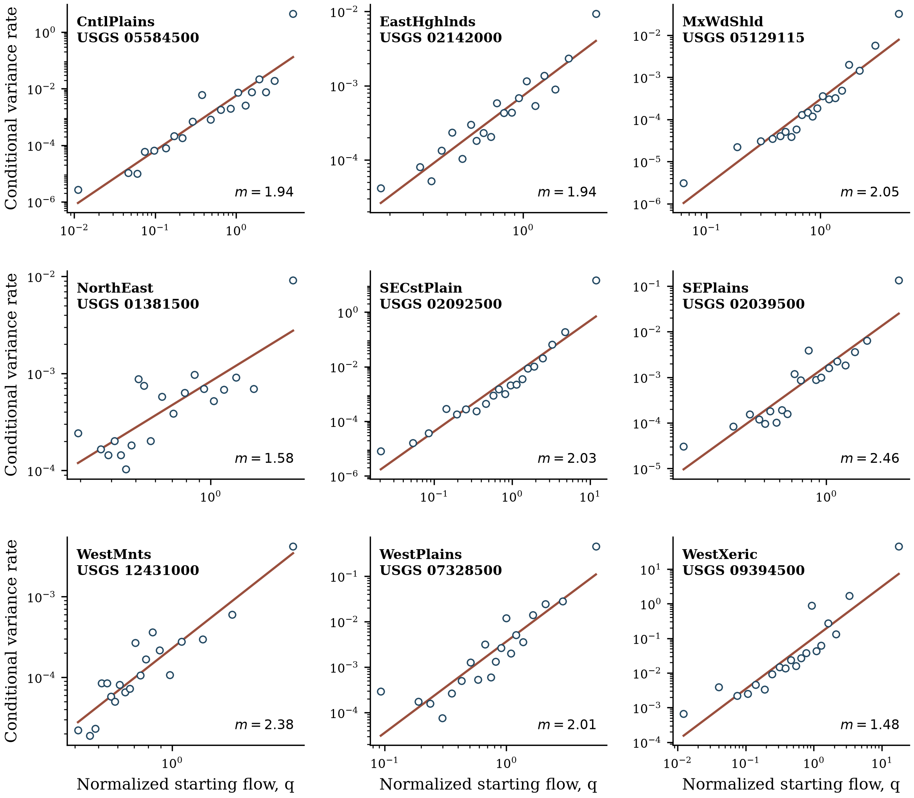
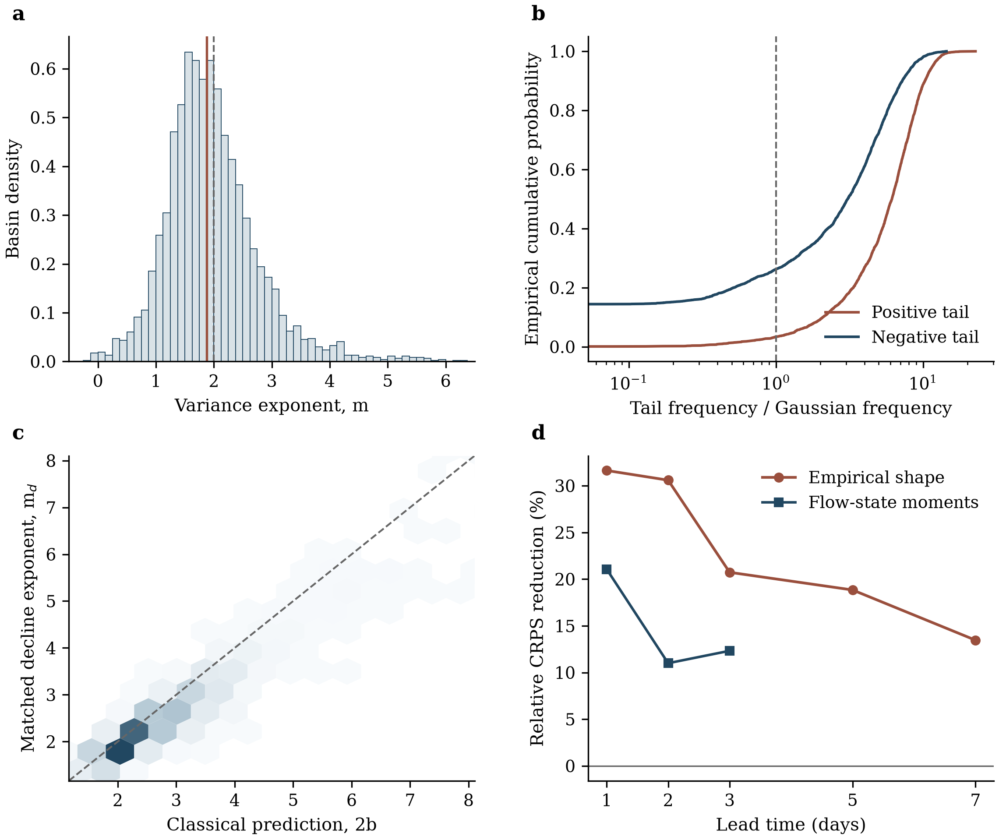

# Dry-period streamflow variance scaling and heavy tails

Reproducibility materials for **“Dry-Period Streamflow Variance Scaling and Heavy Tails Improve Conditional Low-Flow Prediction.”**

## Study in brief

During periods screened for detected basin-average precipitation and proxy snowmelt, streamflow generally recedes but does not follow a perfectly smooth curve. This study measures the day-to-day departures around the expected recession instead of treating them as unspecified error. It separates the expected change, the flow-dependent variance around that change, and the frequency of unusually large positive and negative departures.

The principal variance exponent was estimable for 3,727 of 5,227 accepted CONUS basins using approximately 9.20 million one-day transitions. Basin-specific variance and residual distributions were then tested in conditional low-flow predictions for 2016–2025. The prediction experiment assumes that screened dry conditions continue through the forecast endpoint; it does not predict whether the dry spell itself will continue.

A concise step-by-step explanation of the method and equations is provided in [`docs/METHODS_PLAIN_LANGUAGE.txt`](docs/METHODS_PLAIN_LANGUAGE.txt).

## Key notation

| Symbol | Technical meaning | Plain-language meaning |
|---|---|---|
| $q$ | Basin-normalized streamflow | Current flow relative to that basin’s usual positive flow |
| $\Delta q(\tau)$ | Flow change over $\tau$ days | How far the river moved up or down |
| $\mu_\Delta(q,\tau)$ | Conditional mean increment rate | Expected change from the present flow state |
| $S^2(q,\tau)$ | Finite-time conditional increment variance | The expected squared spread around that change |
| $c_\tau$ | Variance-law coefficient | Overall uncertainty magnitude |
| $m_\tau$ | Variance-law exponent | How rapidly uncertainty grows with flow |
| $\lambda^*$ | Local variance-stabilizing power | Whether a log or another local power better stabilizes variance |
| $z$ | Standardized residual/departure | How unusual one change was after its expected scale was removed |
| $T$, $T^+$, $T^-$ | Gaussian-relative tail multiples | How often extreme changes occur relative to Gaussian expectations |
| $b$ | Mean recession exponent | How expected decline depends on flow |
| $\gamma$ | Recession-rate variance exponent | How variability in the drainage rate changes with flow |
| CRPS | Score for a complete predicted distribution | Accuracy of the entire endpoint distribution |
| BS | Brier score | Accuracy of a predicted low-flow probability |

## What this repository reproduces

The repository separates three tasks that are often conflated:

1. **Method demonstration** — rerun the principal variance-scaling and tail estimators on complete released analysis-ready records for nine objectively selected USGS gages, one from each aggregated ecoregion.
2. **Result verification** — recompute 81 selected continental, inferential, prediction, and place-based results from frozen basin-level analysis products.
3. **Full analysis rerun** — execute the normalized national workflow after staging the external raw and analysis-ready inputs listed in [`docs/DATA.md`](docs/DATA.md).

The nine-gage records illustrate the estimator and are not substitutes for the continental sample. The paper’s registered headline claims are verified from the included basin-level products. Large raw and intermediate files remain outside GitHub.

## Quick start

Python 3.11 is the tested and pinned runtime.

```bash
python -m venv .venv
source .venv/bin/activate
python -m pip install -r requirements-core.txt
make reproduce
```

`make reproduce`:

- fits the primary estimator to the nine real-gage examples;
- recomputes the registered headline results;
- creates two compact provenance figures in `outputs/figures/`;
- runs the automated tests; and
- audits release scope, paths, and file hashes.

Generated products are written under `outputs/` and are not versioned.

## From equation to code

| Calculation | Implementation | Released evidence |
|---|---|---|
| Basin and matched-data quality control | [`workflow/08_quality_control_matched_data.py`](workflow/08_quality_control_matched_data.py) | [`data/derived/basin_sample.csv.gz`](data/derived/basin_sample.csv.gz) |
| Proxy snowmelt screen | [`workflow/09_build_snowmelt_proxy.py`](workflow/09_build_snowmelt_proxy.py), [`workflow/lib/hydrology.py`](workflow/lib/hydrology.py) | Screen fields in the real-gage records |
| Direct transitions and dry-period flags | [`workflow/10_build_transition_inventory.py`](workflow/10_build_transition_inventory.py) | [`data/example/example_transitions.csv.gz`](data/example/example_transitions.csv.gz) |
| Conditional moments and power-law fit | [`workflow/lib/stochastic.py`](workflow/lib/stochastic.py) | `outputs/example/example_conditional_bins.csv` |
| Public nine-gage implementation | [`reproducibility/core.py`](reproducibility/core.py), [`reproducibility/run_example.py`](reproducibility/run_example.py) | `outputs/example/` |
| Continental basin fits | [`workflow/14_run_continental_recession.py`](workflow/14_run_continental_recession.py) | [`data/derived/basin_scaling.csv.gz`](data/derived/basin_scaling.csv.gz) |
| Population inference and lag stability | [`workflow/16_test_hypotheses.py`](workflow/16_test_hypotheses.py) | Scaling summary tables in `data/derived/` |
| Standardized departures and heavy tails | [`workflow/17_detect_temporal_change.py`](workflow/17_detect_temporal_change.py) | [`data/derived/basin_distribution.csv.gz`](data/derived/basin_distribution.csv.gz) |
| Direction-resolved tails | [`workflow/sensitivity_tail_direction_clustering.py`](workflow/sensitivity_tail_direction_clustering.py) | [`data/derived/basin_signed_tails.csv.gz`](data/derived/basin_signed_tails.csv.gz) |
| Recession-theory bridge | [`workflow/sensitivity_recession_theory_bridge.py`](workflow/sensitivity_recession_theory_bridge.py) | [`data/derived/basin_theory_bridge.csv.gz`](data/derived/basin_theory_bridge.csv.gz) |
| Conditional low-flow evaluation | [`workflow/18_test_operational_value.py`](workflow/18_test_operational_value.py) | [`data/derived/basin_prediction_q10.csv.gz`](data/derived/basin_prediction_q10.csv.gz) |
| Registered-claim verification | [`reproducibility/verify_reported_results.py`](reproducibility/verify_reported_results.py) | `outputs/verification/` |
| Product lineage | [`provenance/SOURCE_MAP.csv`](provenance/SOURCE_MAP.csv) | Source and producer mapping |

## Diagnostic provenance



*Nine real-gage examples generated by `make demo`. The figure shows the measured flow–variance relation and empirical standardized-departure tails; it demonstrates the estimator but does not replace the continental inference.*



*Selected continental claims recomputed by `make verify` from the released basin-level products. The registry checks numerical provenance and is not an inventory of every number in the article.*

The previews are explanatory repository figures, not manuscript artwork. Their sidecar records the exact maintainer environment used to render the PNGs; the numerical release runtime remains the Python 3.11 environment tested in continuous integration.

## Repository contents

| Path | Purpose |
|---|---|
| [`workflow/`](workflow/) | Normalized national workflow through inference and conditional prediction, including sensitivity analyses |
| [`data/example/`](data/example/) | Complete analysis-ready records for nine objectively selected real gages |
| [`data/derived/`](data/derived/) | Compact basin-level products used to recompute reported continental summaries |
| [`data/expected/`](data/expected/) | Machine-readable registry of reported values and tolerances |
| [`reproducibility/`](reproducibility/) | Example, verification, figure, and release-audit commands |
| [`provenance/`](provenance/) | Source-to-product map, sanitized execution receipts, and SHA-256 manifest |
| [`docs/`](docs/) | Data lineage, full-workflow instructions, codebook, and claim map |

The manuscript builder, submission files, manuscript artwork, exploratory failures, and national raw/intermediate arrays are intentionally excluded.

## Main commands

```bash
make demo       # rerun the core estimator on nine real gages
make verify     # recompute and check the registered claims
make figures    # create diagnostic provenance figures
make test       # run automated tests
make audit      # check manifests, paths, release scope, and excluded content
```

The complete national workflow is computationally substantial and requires external inputs. Read [`docs/FULL_WORKFLOW.md`](docs/FULL_WORKFLOW.md) before using `make full`. The original precipitation/PET, USGS-batch, inventory, and discharge-QC preparation steps predated the numbered pipeline, so an independent raw reconstruction also requires their immutable archived snapshots or newly tested acquisition wrappers. This limitation does not affect `make verify`, which recomputes the registered statistics from the released frozen basin products.

The verifier also writes `outputs/verification/huc02_summary.csv`, which reconstructs the descriptive regional medians and sample sizes used for place-based comparisons. [`docs/CLAIM_MAP.md`](docs/CLAIM_MAP.md) connects every registered claim family to its manuscript location.

## Reproducibility boundary and scientific guardrails

- The exponent describes finite daily increments, not an infinitesimal diffusion coefficient.
- A continental center near $m=2$ is not a universal exponent.
- Screening excludes detected basin-average precipitation and proxy snowmelt but cannot remove every unresolved input.
- Heavy tails are measured empirical properties; this analysis does not assign them to a single physical cause.
- Statistical irreversibility is a path-asymmetry measure and is not physical entropy production.
- Ecoregions and HUC2 regions are descriptive reporting strata, not causal process domains.
- Prediction scores are conditional on observed continuation of the screened dry period and are not unconditional event forecasts.

See [`docs/REPRODUCIBILITY.md`](docs/REPRODUCIBILITY.md) for the exact distinction among computational reproduction, numerical verification, and independent raw-data reconstruction. Integer counts must agree exactly; floating-point checks use the explicit tolerances in [`data/expected/reported_claims.csv`](data/expected/reported_claims.csv).

## Documentation guide

- [`docs/METHODS_PLAIN_LANGUAGE.txt`](docs/METHODS_PLAIN_LANGUAGE.txt): compact method sequence and underlying equations in plain language
- [`docs/DATA.md`](docs/DATA.md): released and external data, lineage, and acquisition boundary
- [`docs/CODEBOOK.md`](docs/CODEBOOK.md): column-level descriptions of the compact release products
- [`docs/FULL_WORKFLOW.md`](docs/FULL_WORKFLOW.md): guarded national-workflow instructions
- [`docs/REPRODUCIBILITY.md`](docs/REPRODUCIBILITY.md): what each reproduction level establishes
- [`docs/CLAIM_MAP.md`](docs/CLAIM_MAP.md): registered claims and manuscript locations
- [`docs/CONTRIBUTING.md`](docs/CONTRIBUTING.md): contribution and validation expectations

## Citation and archival release

Citation metadata are provided in [`CITATION.cff`](CITATION.cff). A versioned GitHub release can be archived in a DOI-granting repository to provide an immutable computational record.

## Authors

- Amobichukwu C. Amanambu, The University of Alabama
- Shahab Alam, University of West Florida
